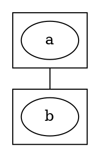

# :mage_woman: GraphWiz

[![build][Shield]][Action]

GraphWiz provides a small monadic DSL to generate DOT files. It aims at being intuitive to use, by replicating in your code the structure of the resulting DOT file.

It's a "wizard" for Graphviz's DOT format, hence the name "GraphWiz".

[Action]: https://github.com/nicuveo/graphwiz/actions/workflows/haskell.yml?query=branch%3Amain
[Shield]: https://img.shields.io/github/actions/workflow/status/nicuveo/graphwiz/haskell.yml?event=push&style=flat&branch=main&label=build

## Overview

### Graph creation

This library exports a simple monad: `Dot` (and its transformer version `DotT`), that you can only run with a function that indicates how the graph should be rendered: `graph`, `digraph`, `strictGraph`, `strictDigraph`. Within this monad, you can create graph elements with `node`, `edge` (or `-->`), `subgraph`, `cluster`, and their variants.

All such functions that create an element return an `Entity`, an ID that uniquely identifies that element within the graph. Additionally, the ID of the latest created entity (regardless of its type) can be accessed with `itsID`.

```haskell
digraph do
  a <- node "a"
  b <- node "b"
  a --> b
  subgraph do
    c <- node "c"
    a --> c
    b --> c
```

### Attributes

You can set default attributes for an entity type with `defaults`. You can access the attributes of a specific entity with `attributes`, and the latest created entity's attributes are accessible with `its`. All of those give you lenses to values within the underlying state; you can manipulate them with the `=` [lens operators](https://hackage.haskell.org/package/lens-5.3.3/docs/Control-Lens-Setter.html#g:5).

Attributes are represented as a simple mapping from `Text` to `Text`, to avoid being too restrictive. There is, however, one lens per attribute listed in the [Graphviz documentation](https://graphviz.org/doc/info/attrs.html), allowing you to avoid strings in attributes declarations.

```haskell
graphT do
  defaults Edge .= [("style", "dotted"), ("color", "blue")]
  defaults Node . shape ?= "hexagon"
  x <- node "x"
  its fontcolor ?= "red"
  liftIO $ print =<< use (attributes x)
```

### Text.Builder

For efficiency and convenience, the result of running the `Dot` monad is not a `String` or `Text`; it's a [Text.Builder](https://hackage.haskell.org/package/text-builder-0.6.7.3/docs/Text-Builder.html), that can be converted to a strict `Text` or even printed directly to the standard output.

### Auto compound

The DOT syntax to draw edges between clusters is quite cumbersome. We have to declare the graph to be `compound`, and we have to create the edge between two nodes within the clusters, with specific attributes.



GraphWiz automates the task: if one end of an edge is a cluster, the `compound` attribute is added to the graph, and the correct attributes are set at rendering time. To be as unobtrusive as possible, the values of `ltail` and `lhead` will not be updated if already present, trusting the user to know best.

```haskell
graph do
  (cluster_a, _) <- cluster $ node "a"
  (cluster_b, _) <- cluster $ node "b"
  cluster_a --> cluster_b
```

## Full example

From the [example](/example) folder:

##### Haskell source
```haskell
main =
  TB.putLnToStdOut $
    digraph do
      defaults Node . style ?= "filled"

      ast <- cluster_ do
        its label ?= "front end"

        source <- node "source code"
        its fillcolor ?= "#c3ffd8"

        ast <- node "AST"
        its fillcolor ?= "yellow"

        source --> ast
        its label ?= "parsing"

        pure ast

      cluster do
        its label ?= "middle end"

        ir <- node "IR"
        its shape     ?= "diamond"
        its fillcolor ?= "salmon"

        ast --> ir
        its label ?= "lowering"
        its style ?= "dotted"
```

#### Resulting DOT file

```DOT
digraph {
  subgraph cluster0 {
    label="front end";
    node1 [label="source code",style="filled",fillcolor="#c3ffd8"]
    node2 [label="AST",style="filled",fillcolor="yellow"]
    node1 -> node2 [label="parsing"]
  }
  subgraph cluster4 {
    label="middle end";
    node5 [label="IR",style="filled",fillcolor="salmon",shape="diamond"]
    node2 -> node5 [label="lowering",style="dotted"]
  }
}
```

#### Resulting PNG


